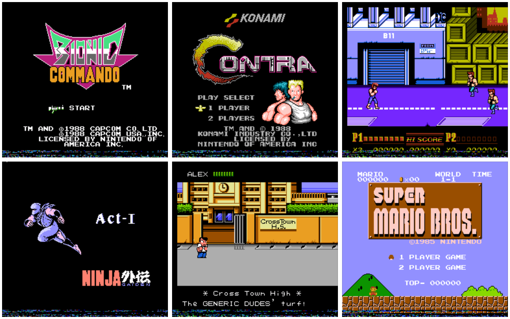

# An NES Emulator in Rust

My first goal in building this emulator was to obtain a deeper understanding of how the NES works on a cycle-by-cycle basis.
Along the way, I looked at a lot of other emulators and read a lot of code.
Most of them struck me as being very clever -- so clever that they were hard to understand.
That lead me to my second goal:

I wanted to build the least clever NES emulator possible.

* No arcane performance optimizations
* No cyclical dependencies or global variables
* No giant maze-like functions

There's still work to do, but it's come a long way.
It plays most of the games I care about and passes most [test ROMs](#test-statuses).
Best of all, it's not very clever. :)

## Requirements

To build and run this emulator you must have:

* [Rust Nightly](https://www.rust-lang.org/en-US/install.html)
* [Retroarch](http://www.retroarch.com/?page=platforms)

You should be able to get 60 fps using any modern workstation.

## Usage

To build the emulator:

```
cargo build --release
```

You can also build the emulator with CPU logging enabled.
This is useful for debugging, but the performance is terrible:

```
cargo build --release --features log
```

The emulator is impelemented as a Libretro core.
This means that you can't run it as a stand-alone program.
This is how you run the emulator on linux:

```
retroarch -L target/release/libnes.so your-rom-here.nes
```

On Windows and Mac you will most likely need to load the core via the retroarch GUI.
Some Libretro features (like save states) aren't currently implemented.

## Architecural Overview

The structure of this program closely resembles the high-level flow of data within the NES.
Code running on the CPU drives all of the subsystems by interacting with them through a memory bus.

In the diagram below, `x --> y` means "x owns y."
Keep in mind that it's a bit of a simplification:


Let's take a look at three different levels of abstraction to get a rough feel for how the system works.

#### 10,000 Foot View

The main loop of the emulator is pretty simple:

1.  Libretro requests a frame (1/60th of a second) of audio and video, and gives us gamepad state.
2.  We execute CPU instructions until the "end of frame" signal is seen.
3.  The generated audio and video are sent to Libretro for rendering.

#### 1,000 Foot View

Each CPU instruction takes a certan number of CPU clock cycles to complete -- it could be 2-8 depending on the instruction.
These clock cycles actually drive the entire system. Here's what happens every clock cycle:

1.  Part of a CPU instruction is executed.
2.  The PPU (graphics system) is run for three PPU cycles.
    This renders three pixels.
3.  The APU (audo system) is run for one APU cycle.

**Trivia!:** The fact that we execute PPU/APU cycles inline with the CPU instructions makes this a "real time" emulator.
Other approaches wait until the CPU instruction is completely finished, or until several instructions are finished before clocking the PPU and APU.

#### 100 Foot View

In one PPU cycle:

1.  The background and sprites for a specific pixel are rendered, composited and output to the buffer.
2.  A pre-loading operation ensures that upcoming background and sprite data is pipelined.
3.  Signals may be sent back to the CPU or to the game cartridge.

In one APU cycle:

1.  Square, triangle, noise and DMC waveforms are generated.
2.  The frame counter is ticked, which determines sound length, sweep and volume, and which can send singnals to the CPU

## Supported Games

The emulator should run any rom in iNES format that uses ines mappers 0-4 and has vertical or horizontal mirroring. This includes most popular games, like:

* Super Mario Brothers 1, 2 and 3
* Contra
* Mega Man 1, 2, and 3

If you're curious if a specific game is supported, look it up [here](http://bootgod.dyndns.org:7777/search.php) and see if the ines mapper number is 0-4.
If you try to run a game that uses an unsupported mapper or mirroring mode, the program will exit with an error.

Known glitches for specific games will be tracked in the repo's Issue tracker.

## Accuracy

Accuracy in emulation is a never-ending quest. :)

This emulator is currently accurate to within one CPU cycle.
At the time of this writing, it's very close to being PPU cycle accurate, but the CPU and PPU clocks are ever so slightly misaligned.
This doesn't affect most games, but it's the reason for most of the test failures below.

## Tests Statuses

To run the emulator's built-in test-suite:

```
cargo test
```

More detailed testing is accomplided via test ROMs:

* [x] instr_test-v5/all_instrs.nes
* [x] blargg_apu_2005.07.30/01.len_ctr.nes
* [x] blargg_apu_2005.07.30/02.len_table.nes
* [x] blargg_apu_2005.07.30/03.irq_flag.nes
* [x] blargg_apu_2005.07.30/04.clock_jitter.nes
* [x] blargg_apu_2005.07.30/05.len_timing_mode0.nes
* [x] blargg_apu_2005.07.30/06.len_timing_mode1.nes
* [x] blargg_apu_2005.07.30/07.irq_flag_timing.nes
* [x] blargg_apu_2005.07.30/08.irq_timing.nes
* [x] blargg_apu_2005.07.30/09.reset_timing.nes
* [x] blargg_apu_2005.07.30/10.len_halt_timing.nes
* [x] blargg_apu_2005.07.30/11.len_reload_timing.nes
* [x] apu_mixer/noise.nes
* [x] apu_mixer/triangle.nes
* [x] apu_mixer/square.nes
* [x] apu_mixer/dmc.nes
* [x] apu_test/apu_test.nes
* [x] blargg_ppu_tests_2005.09.15b/palette_ram.nes
* [x] blargg_ppu_tests_2005.09.15b/power_up_palette.nes
* [x] blargg_ppu_tests_2005.09.15b/sprite_ram.nes
* [x] blargg_ppu_tests_2005.09.15b/vbl_clear_time.nes
* [x] blargg_ppu_tests_2005.09.15b/vram_access.nes
* [x] sprite_hit_tests_2005.10.05/01.basics.nes
* [x] sprite_hit_tests_2005.10.05/02.alignment.nes
* [x] sprite_hit_tests_2005.10.05/03.corners.nes
* [x] sprite_hit_tests_2005.10.05/04.flip.nes
* [x] sprite_hit_tests_2005.10.05/05.left_clip.nes
* [x] sprite_hit_tests_2005.10.05/06.right_edge.nes
* [ ] sprite_hit_tests_2005.10.05/07.screen_bottom.nes
* [x] sprite_hit_tests_2005.10.05/08.double_height.nes
* [x] sprite_hit_tests_2005.10.05/09.timing_basics.nes
* [x] sprite_hit_tests_2005.10.05/10.timing_order.nes
* [x] sprite_hit_tests_2005.10.05/11.edge_timing.nes
* [x] vbl_nmi_timing/1.frame_basics.nes
* [x] vbl_nmi_timing/2.vbl_timing.nes
* [x] vbl_nmi_timing/3.even_odd_frames.nes
* [x] vbl_nmi_timing/4.vbl_clear_timing.nes
* [ ] vbl_nmi_timing/5.nmi_suppression.nes
* [ ] vbl_nmi_timing/6.nmi_disable.nes
* [ ] vbl_nmi_timing/7.nmi_timing.nes
* [ ] nmi_sync/demo_ntsc.nes
* [x] ppu_vbl_nmi/rom_singles/01-vbl_basics.nes
* [x] ppu_vbl_nmi/rom_singles/02-vbl_set_time.nes
* [x] ppu_vbl_nmi/rom_singles/03-vbl_clear_time.nes
* [x] ppu_vbl_nmi/rom_singles/04-nmi_control.nes
* [ ] ppu_vbl_nmi/rom_singles/05-nmi_timing.nes
* [ ] ppu_vbl_nmi/rom_singles/06-suppression.nes
* [ ] ppu_vbl_nmi/rom_singles/07-nmi_on_timing.nes
* [ ] ppu_vbl_nmi/rom_singles/08-nmi_off_timing.nes
* [x] ppu_vbl_nmi/rom_singles/09-even_odd_frames.nes
* [ ] ppu_vbl_nmi/rom_singles/10-even_odd_timing.nes

## Acknowledgements

I, and anyone building an NES emulator, owe a huge debt of gratitude to the people at the [NESDev Forum and Wiki](http://nesdev.com/).
Specifically, blargg's test roms are invaluable for anyone who wants to make sure their emulator actually works.

In addition, these emulator codebases were very helpful sanity checks:
[AndreaOrru/laiNES](https://github.com/AndreaOrru/LaiNES) and [fogleman/nes](https://github.com/fogleman/nes)

Finally, thanks to @koute for the excellent [libretro-backend](https://github.com/koute/libretro-backend) crate.

## Copyright & License

Copyright 2018 Starr Horne. See LICENSE file for license. 


